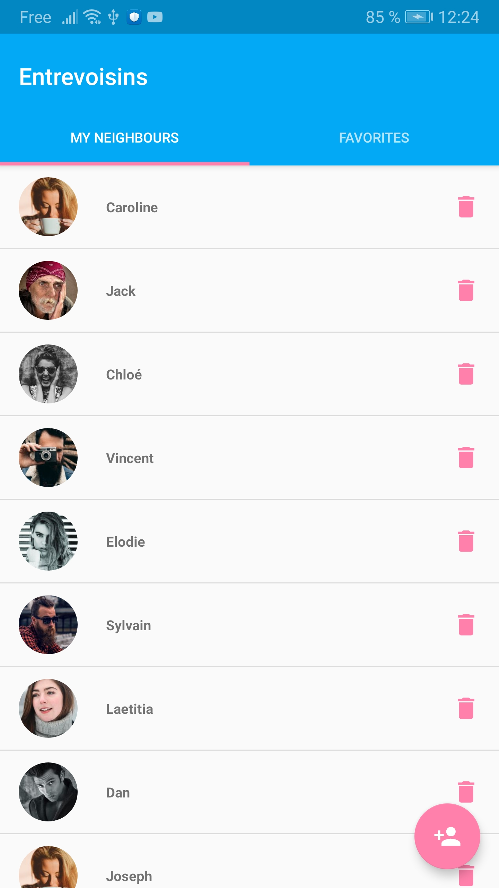
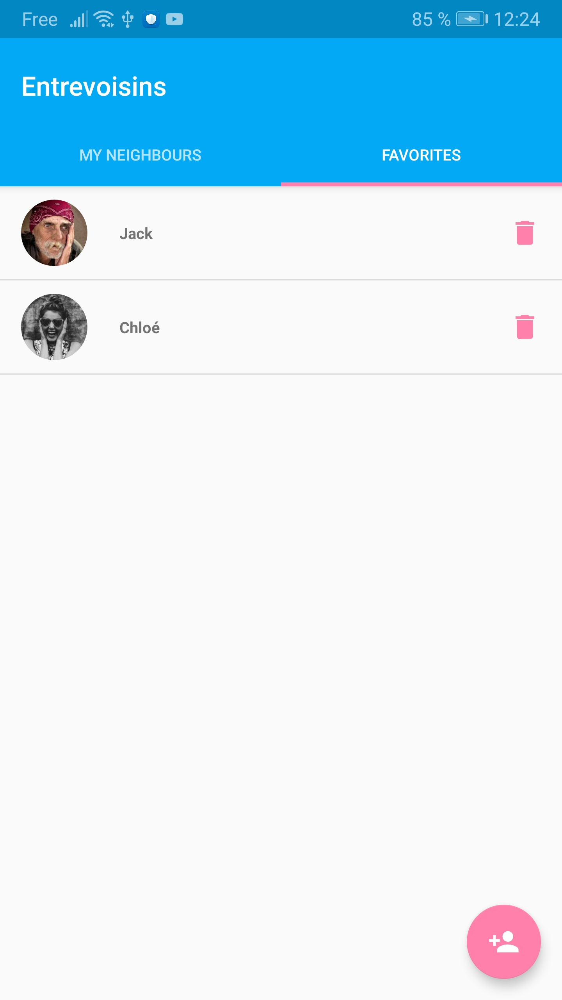

# Entrevoisins

Entrevoisins est une application qui permet à des personnes d’un même quartier de se rendre des petits services : garde d’animaux, petit bricolage, troc d’objets, cours particuliers, de nombreuses options s’offrent aux utilisateurs.

|  |  |  |
|:---:|:---:|:---:|

## Installation
Cloner ce repertoire et importer sur **Android Studio**
```bash
git clone git@github.com:Sango17/Entrevoisins.git
```

## Fonctionnalités récentes
* Bouton de retour à l'élément précédent
* Avatar de l'utilisateur
* Details de l'utilisateur
* Bouton d’ajout du voisin à la liste de favoris
* Onglet Favoris dans lequel les utilisateurs marqués comme favoris s’affichent

